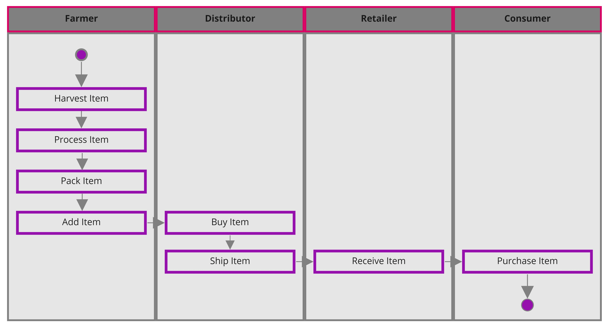
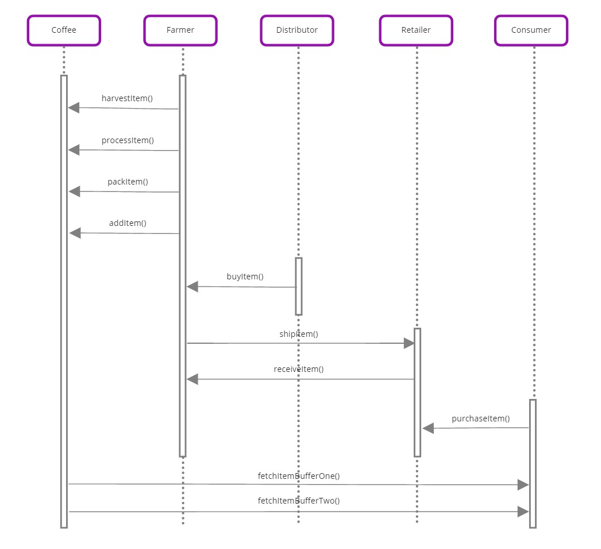
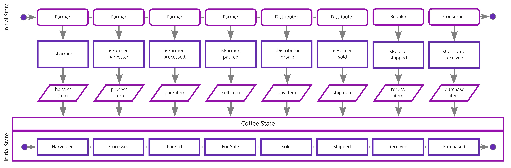
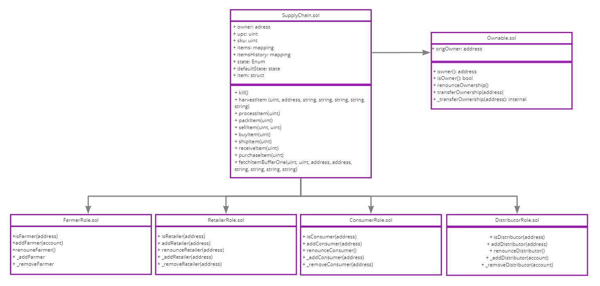

# Coffeebloxx - Supply chain & data auditing

This repository containts an Ethereum DApp that demonstrates a Supply Chain flow between a Seller and Buyer. The user story is similar to any commonly used supply chain process. A Seller can add items to the inventory system stored in the blockchain. A Buyer can purchase such items from the inventory system. Additionally a Seller can mark an item as Shipped, and similarly a Buyer can mark an item as Received.

The DApp User Interface when running should look like...


## Getting Started

These instructions will get you a copy of the project up and running on your local machine for development and testing purposes.

### Prerequisites

Please make sure you've already installed ganache-cli, Truffle and enabled MetaMask extension in your browser.

### Installing

> The code is written for **Solidity v0.4.24**. At the time of writing, the current Truffle v5 comes with Solidity v0.5 that requires function *mutability* and *visibility* to be specified (please refer to Solidity [documentation](https://docs.soliditylang.org/en/v0.5.0/050-breaking-changes.html) for more details). To use this starter code, please run `npm i -g truffle@4.1.14` to install Truffle v4 with Solidity v0.4.24. 

A step by step series of examples that tell you have to get a development env running

Clone this repository:

```
git clone https://github.com/FabianIAM12/coffeebloxx
```

Change directory to ```project-6``` folder and install all requisite npm packages (as listed in ```package.json```):

```
cd project-6
npm install
```

Launch Ganache:

```
ganache-cli -m "spirit supply whale amount human item harsh scare congress discover talent hamster"
```

Your terminal should look something like this:


In a separate terminal window, Compile smart contracts:

```
truffle compile
```

Your terminal should look something like this:


This will create the smart contract artifacts in folder ```build\contracts```.

Migrate smart contracts to the locally running blockchain, ganache-cli:

```
truffle migrate
```

Your terminal should look something like this:


Test smart contracts:

```
truffle test
```

All 10 tests should pass.


In a separate terminal window, launch the DApp:

```
npm run dev
```

## Program versions

node (v14.15.3)
As an asynchronous event-driven JavaScript runtime, Node.js is designed to build scalable network applications.

Truffle (v4.1.14):
Truffle is a development environment, testing framework and asset pipeline for Ethereum. The biggest benefits for this project:
- Built-in smart contract compilation
- Automated contract testing
- Network management for deploying to many public & private networks

web3 (v1.2.1)
The web3.js library is a collection of modules that contain functionality for the ethereum ecosystem.
- It provides functionality to interact with the ethereum blockchain through an browser interface.
- Connects with a wallet provider like metamask.

## The contract

Is available on the rinkeby testnet:

https://rinkeby.etherscan.io/address/0x9c361fe77722f7f3396ef32df788e81e1aeb14d5

Example Transaction Hash: 

0x5eb8b002b2259ef136e7e53c945c21f130d46ccb4b20fc7a417a239a77af182d

## Built With

* [Ethereum](https://www.ethereum.org/) - Ethereum is a decentralized platform that runs smart contracts
* [Truffle Framework](http://truffleframework.com/) - Truffle is the most popular development framework for Ethereum with a mission to make your life a whole lot easier.

## UML Documents

### Activity

### Sequence

### State

### Data modeling

